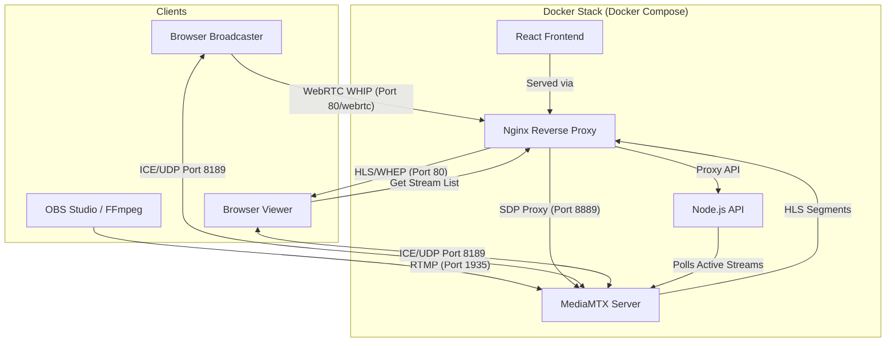

# StreamFlow 🎬

A production-grade **low-latency live streaming platform** powered by **WebRTC**, **MediaMTX**, **Node.js**, **React**, and **Nginx**.

StreamFlow supports both traditional RTMP/HLS streaming and modern, ultra-low-latency **WebRTC (WHIP/WHEP)** broadcasting directly from the browser.

---

## 🏗 System Architecture

StreamFlow leverages a distributed microservices architecture orchestrated via Docker.



### Component Roles

1.  **React Frontend**: Provides the user interface for watching and broadcasting. It switches between `watch` (viewing) and `broadcast` (publishing) modes.
2.  **Node.js (Express) API**: Acts as the discovery layer. It continuously polls MediaMTX's internal API (`/v3/paths/list`) to maintain a real-time list of active streams and their metadata.
3.  **MediaMTX**: The heart of the platform. It handles multi-protocol media ingestion (RTMP, WHIP) and delivery (HLS, WHEP). It manages the "Paths" where video is stored and routed.
4.  **Nginx**: The entry point for all HTTP traffic. It handles:
    *   Serving the React SPA.
    *   Proxying `/api/` requests to the Node.js backend.
    *   Proxying `/hls/` and `/webrtc/` requests to MediaMTX.
    *   Managing **CORS headers** and **SDP exchange** for WebRTC.

---

## 📡 How WebRTC Works in StreamFlow

We use two industry-standard protocols for WebRTC: **WHIP** (for publishing) and **WHEP** (for viewing).

### 1. Broadcasting (WHIP) Flow
When you click "Go Live" in your browser:
1.  **Media Capture**: The frontend uses `getUserMedia()` to access your camera and microphone.
2.  **Offer Creation**: An `RTCPeerConnection` is created, and an **SDP Offer** is generated.
3.  **WHIP POST**: The frontend sends this SDP Offer to Nginx at `POST /webrtc/{streamKey}/whip`.
4.  **SDP Exchange**: Nginx proxies this to MediaMTX on port 8889. MediaMTX returns an **SDP Answer**.
5.  **ICE Negotiation**: The browser and MediaMTX use the host's LAN IP and port **8189/udp** to establish a direct peer-to-peer data channel.

### 2. Viewing (WHEP) Flow
When you click "Watch Live":
1.  **WHEP Request**: The `VideoPlayer` component creates an `RTCPeerConnection` and sends a "receiver-only" SDP Offer to `POST /webrtc/{streamName}/whep`.
2.  **Playback**: MediaMTX returns the SDP Answer, and the media tracks are attached to the HTML5 `<video>` element via `srcObject`.
3.  **HLS Fallback**: If the WebRTC connection fails (e.g., due to strict firewalls), the player automatically falls back to **HLS.js** for maximum compatibility.

---

## 🔄 Data Communication & Protocols

| Interaction | Protocol | Goal |
| :--- | :--- | :--- |
| **Broadcaster -> Server** | WHIP (WebRTC) | Sub-second ingestion from Browser |
| **OBS -> Server** | RTMP | Professional ingestion from desktop software |
| **Server -> Viewer** | WHEP (WebRTC) | Ultra-low-latency viewing (< 500ms) |
| **Server -> Viewer** | HLS | Resilient chunk-based delivery (10-20s latency) |
| **Backend -> MediaMTX** | HTTP REST | Discovery of active streams and stats |
| **Frontend -> Backend** | JSON REST | Fetching the list of live channels |

---

## 🚀 Quick Start

### 1. Launch the Stack
```bash
docker compose up --build -d
```
Accessible at: `http://localhost`

### 2. Go Live (Web Cam)
1.  Click **🎥 Go Live** in the header.
2.  Enter a channel name.
3.  Allow camera permissions and click **Start**.

### 3. Go Live (OBS Studio)
- **Service**: Custom
- **Server**: `rtmp://localhost:1935/live`
- **Stream Key**: `anyname`

---

## 🛠 Troubleshooting WebRTC
WebRTC relies on UDP traffic. If you are behind a strict firewall or using a VPN:
- Ensure port **8189/udp** is open on your host machine.
- Verify the `webrtcICEHostNAT1To1IPs` setting in `media-server/mediamtx.yml` matches your server's reachable IP.
- Check the browser console (F12) for "ICE Gathering State" to debug connection timeouts.
