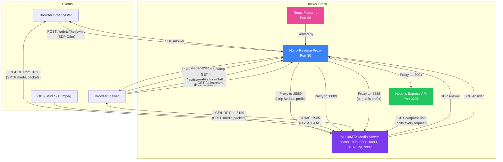

# StreamFlow

A production-grade, low-latency live streaming platform powered by **WebRTC**, **MediaMTX**, **Node.js**, **React**, and **Nginx**. StreamFlow supports both traditional RTMP/HLS streaming and modern, ultra-low-latency **WebRTC (WHIP/WHEP)** broadcasting directly from the browser.

---

## Table of Contents

- [Features](#features)
- [System Architecture](#system-architecture)
- [Service Breakdown](#service-breakdown)
- [Data Flow](#data-flow)
  - [Broadcasting (WHIP)](#1-broadcasting-whip---browser-to-server)
  - [Viewing (WHEP)](#2-viewing-whep---server-to-browser)
  - [RTMP Ingest](#3-rtmp-ingest---obs--ffmpeg-to-server)
  - [Stream Discovery](#4-stream-discovery---how-the-ui-knows-whats-live)
- [WebRTC Technical Deep Dive](#webrtc-technical-deep-dive)
  - [SDP Signaling Phase](#1-sdp-signaling-phase)
  - [ICE Negotiation and NAT Traversal](#2-ice-negotiation-and-nat-traversal)
  - [Media Transport Layer](#3-media-transport-layer)
  - [HLS Fallback Mechanism](#4-hls-fallback-mechanism)
- [Protocol and Port Reference](#protocol-and-port-reference)
- [Quick Start](#quick-start)
- [Local Development](#local-development)
- [Project Structure](#project-structure)
- [Configuration Reference](#configuration-reference)
- [Troubleshooting](#troubleshooting)

---

## Features

| Feature | Description |
|:---|:---|
| **Browser Broadcasting** | Go live directly from your webcam using WebRTC WHIP — no software required |
| **Ultra-Low-Latency Viewing** | Watch streams with sub-500ms latency via WebRTC WHEP |
| **HLS Fallback** | Automatic fallback to HLS.js when WebRTC is unavailable (firewalls, VPNs) with 10-20s latency |
| **RTMP Ingest** | Publish from OBS Studio, FFmpeg, or any RTMP-compatible encoder |
| **Auto Stream Discovery** | Backend polls MediaMTX to detect live streams in real-time — no manual registration |
| **Multi-Protocol Media Server** | MediaMTX handles RTMP, WHIP, WHEP, and HLS simultaneously on separate ports |
| **Reverse Proxy Routing** | Nginx unifies all protocols behind a single port (80) with proper CORS handling |
| **Docker Compose Orchestration** | Entire stack launches with one command across four containers |
| **Dark-Themed UI** | Modern dark interface built with CSS custom properties and the Inter font family |
| **Fullscreen Mode** | Both broadcaster preview and video player support native fullscreen |
| **OBS Setup Guide** | Built-in modal with RTMP URL and stream key, with copy-to-clipboard and key generation |

---

## System Architecture

```
┌─────────────────────────────────────────────────────────────────────────────────┐
│                              CLIENTS                                            │
│                                                                                 │
│   ┌──────────────────┐   ┌──────────────────┐   ┌──────────────────────────┐   │
│   │  Browser          │   │  Browser          │   │  OBS Studio / FFmpeg     │   │
│   │  (Broadcaster)    │   │  (Viewer)         │   │  (Professional Encoder)  │   │
│   │                   │   │                   │   │                          │   │
│   │  getUserMedia()   │   │  RTCPeerConnection│   │                          │   │
│   │  → WHIP POST      │   │  → WHEP POST      │   │                          │   │
│   └──────┬──────┬─────┘   └──────┬──────┬─────┘   └────────────┬─────────────┘   │
│          │      │                │      │                       │               │
│          │ SDP  │ ICE/UDP        │ SDP  │ ICE/UDP               │ RTMP          │
└──────────┼──────┼────────────────┼──────┼───────────────────────┼───────────────┘
           │      │                │      │                       │
           ▼      │                ▼      │                       │
┌─────────────────┼───────────────────────┼───────────────────────┼───────────────┐
│  DOCKER COMPOSE │ STACK                 │                       │               │
│                 │                       │                       │               │
│  ┌──────────────┼───────────────────────┼───────────────────┐   │               │
│  │  NGINX (Port 80)                     │                   │   │               │
│  │  ┌─────────┐ ┌──────────┐ ┌─────────┴──┐ ┌───────────┐  │   │               │
│  │  │  /*     │ │ /api/*   │ │ /webrtc/*  │ │  /hls/*   │  │   │               │
│  │  │ React   │ │ Backend  │ │ MediaMTX   │ │  MediaMTX │  │   │               │
│  │  │ SPA     │ │ Proxy    │ │ SDP Proxy  │ │  HLS Proxy│  │   │               │
│  │  └────┬────┘ └────┬─────┘ └────┬──────┘ └─────┬─────┘  │   │               │
│  └───────┼──────────┼────────────┼──────────────┼──────────┘   │               │
│          │          │            │              │               │               │
│          ▼          ▼            ▼              ▼               ▼               │
│  ┌────────────┐ ┌─────────┐ ┌──────────────────────────────────────────────┐   │
│  │  FRONTEND  │ │ BACKEND │ │               MEDIAMTX                       │   │
│  │  React+Vite│ │ Express │ │                                              │◄──┼── ICE/UDP
│  │  :80       │ │ :3001   │ │  :1935 RTMP    :8889 WebRTC   :8888 HLS     │   │   Port 8189
│  │            │ │         │ │  :9997 API     :8189 ICE/UDP                 │   │
│  │  Built via │ │ Polls   │ │                                              │   │
│  │  Nginx     │ │ :9997 ──┼─┤  Paths: /v3/paths/list                      │   │
│  └────────────┘ └─────────┘ └──────────────────────────────────────────────┘   │
│                                                                                 │
└─────────────────────────────────────────────────────────────────────────────────┘
```

### Mermaid Diagram


```mermaid
graph TD
    subgraph Clients
        B[Browser Broadcaster]
        V[Browser Viewer]
        O[OBS Studio / FFmpeg]
    end

    subgraph "Docker Stack"
        N[Nginx Reverse Proxy<br/>Port 80]
        M[MediaMTX Media Server<br/>Ports 1935, 8888, 8889, 8189/udp, 9997]
        A[Node.js Express API<br/>Port 3001]
        F[React Frontend<br/>Port 80]
    end

    B -- "POST /webrtc/{key}/whip<br/>(SDP Offer)" --> N
    N -- "Proxy to :8889<br/>(strip /webrtc prefix)" --> M
    M -- "SDP Answer" --> N
    N -- "SDP Answer" --> B
    B <--> |"ICE/UDP Port 8189<br/>(SRTP media packets)"| M

    O -- "RTMP :1935<br/>(H.264 + AAC)" --> M

    V -- "POST /webrtc/{name}/whep<br/>(SDP Offer)" --> N
    N -- "Proxy to :8889" --> M
    M -- "SDP Answer" --> N
    N -- "SDP Answer" --> V
    V <--> |"ICE/UDP Port 8189<br/>(SRTP media packets)"| M

    V -- "GET /hls/{name}/index.m3u8<br/>(HLS fallback)" --> N
    N -- "Proxy to :8888<br/>(strip /hls prefix)" --> M

    V -- "GET /api/streams" --> N
    N -- "Proxy to :3001" --> A
    A -- "GET /v3/paths/list<br/>(polls every request)" --> M

    F -- "Served by" --> N

    style M fill:#7c3aed,stroke:#7c3aed,color:#fff
    style N fill:#3b82f6,stroke:#3b82f6,color:#fff
    style A fill:#22c55e,stroke:#22c55e,color:#fff
    style F fill:#ec4899,stroke:#ec4899,color:#fff
```

---

## Service Breakdown

### 1. React Frontend (`frontend/`)
The single-page application providing the user interface. Built with Vite and served as static files via an Nginx container.

- **Two modes**: `watch` (browse and view live streams) and `broadcast` (publish from webcam)
- **Stream grid**: Displays cards for each live stream with duration timers, polling `/api/streams` every 5 seconds
- **Broadcaster component**: Captures webcam/mic via `getUserMedia()`, creates an `RTCPeerConnection`, and publishes via WHIP
- **VideoPlayer component**: Connects via WebRTC WHEP for sub-second playback, automatically falls back to HLS.js if WebRTC fails
- **OBS Setup modal**: Provides RTMP URL and stream key with copy-to-clipboard functionality
- **No client-side routing**: Mode switching is driven by React state (`viewMode`), not a router library

### 2. Node.js Backend API (`backend/`)
A lightweight Express.js service that acts as the stream discovery layer.

- **`GET /api/streams`**: Fetches active paths from MediaMTX's REST API (`/v3/paths/list`), filters to paths where `ready === true` (an active publisher exists), and returns stream metadata including HLS and WebRTC playback URLs
- **`GET /health`**: Health check endpoint returning `{ status: 'ok' }`
- **Authentication**: Sends `Basic any:` credentials to MediaMTX's API (matching the anonymous auth configuration)

### 3. MediaMTX Media Server (`media-server/`)
The core media engine handling all protocol conversion and media routing. Uses the `bluenviron/mediamtx:latest` Docker image.

- **RTMP server** (`:1935`): Accepts publish connections from OBS Studio, FFmpeg, VLC
- **WebRTC server** (`:8889`): Handles WHIP (ingest) and WHEP (playback) SDP exchange over HTTP
- **ICE/UDP** (`:8189`): Single multiplexed UDP port for all WebRTC media traffic (SRTP packets)
- **HLS server** (`:8888`): Generates MPEG-TS segments and M3U8 playlists for HLS playback
- **REST API** (`:9997`): Internal API for querying active paths, stream metadata, and server state
- **Path routing**: The `all` path configuration accepts any stream key without pre-registration

### 4. Nginx Reverse Proxy (`nginx/`)
The single HTTP entry point that unifies all services behind port 80.

| Route | Upstream | Behavior |
|:---|:---|:---|
| `/*` | `frontend:80` | Serves the React SPA |
| `/api/*` | `backend:3001` | Proxies to the Node.js API |
| `/webrtc/*` | `mediamtx:8889` | Strips `/webrtc` prefix, proxies SDP exchange, handles CORS preflight |
| `/hls/*` | `mediamtx:8888` | Strips `/hls` prefix, proxies HLS segments with CORS headers |

Key Nginx behaviors:
- **CORS for WebRTC**: Adds `Access-Control-Allow-Origin: *` and handles `OPTIONS` preflight requests with a `204` response for the `/webrtc/` location
- **CORS for HLS**: Adds `Access-Control-Allow-Origin: *` so HLS.js can fetch segments cross-origin
- **No body size limit**: `client_max_body_size 0` allows large HLS segment transfers

---

## Data Flow

### 1. Broadcasting (WHIP) — Browser to Server

```
Browser                         Nginx (:80)                    MediaMTX (:8889)
  │                                │                                │
  │  1. getUserMedia()             │                                │
  │  (capture camera + mic)        │                                │
  │                                │                                │
  │  2. new RTCPeerConnection()    │                                │
  │  3. addTrack(video, audio)     │                                │
  │  4. createOffer() → SDP Offer  │                                │
  │                                │                                │
  │  5. POST /webrtc/{key}/whip    │                                │
  │  Content-Type: application/sdp │                                │
  │  Body: SDP Offer               │                                │
  │  ─────────────────────────────►│  6. Rewrite: strip /webrtc     │
  │                                │  ─────────────────────────────►│
  │                                │                                │  7. Parse Offer
  │                                │                                │  8. Allocate Path
  │                                │                                │  9. Generate SDP Answer
  │                                │  10. SDP Answer                │     (includes ICE candidates
  │                                │  ◄─────────────────────────────│      with host NAT IP)
  │  11. SDP Answer                │                                │
  │  ◄─────────────────────────────│                                │
  │                                │                                │
  │  12. setRemoteDescription()    │                                │
  │                                │                                │
  │  13. ICE Negotiation ◄────────────────────────────────────────► │
  │      (STUN: stun.l.google.com)          UDP Port 8189           │
  │                                                                 │
  │  14. DTLS-SRTP Handshake ◄─────────────────────────────────────►│
  │                                                                 │
  │  15. Encrypted RTP Packets ════════════════════════════════════►│
  │      (H.264 video + Opus audio over UDP)                        │
  │                                                                 │
  │  Connection State: "connected" ✓                                │
```

### 2. Viewing (WHEP) — Server to Browser

```
Browser                         Nginx (:80)                    MediaMTX (:8889)
  │                                │                                │
  │  1. new RTCPeerConnection()    │                                │
  │  2. addTransceiver('video',    │                                │
  │       { direction: 'recvonly'})│                                │
  │  3. addTransceiver('audio',    │                                │
  │       { direction: 'recvonly'})│                                │
  │  4. createOffer() → SDP Offer  │                                │
  │                                │                                │
  │  5. POST /webrtc/{name}/whep   │                                │
  │  ─────────────────────────────►│  6. Proxy to :8889             │
  │                                │  ─────────────────────────────►│
  │                                │                                │  7. Match existing Path
  │                                │  8. SDP Answer                 │  8. Generate Answer
  │                                │  ◄─────────────────────────────│
  │  9. SDP Answer                 │                                │
  │  ◄─────────────────────────────│                                │
  │                                                                 │
  │  10. ICE + DTLS-SRTP ◄────────────────────────────────────────►│
  │                                         UDP Port 8189           │
  │                                                                 │
  │  11. ontrack event fires                                        │
  │  12. video.srcObject = stream  ◄═══════════════════════════════│
  │      (RTP packets → decoded frames)                             │
  │                                                                 │
  │  Playback begins (<500ms latency) ✓                             │

  ─── If WebRTC fails, automatic fallback: ───

  │  13. GET /hls/{name}/index.m3u8                                 │
  │  ─────────────────────────────►│  Proxy to :8888                │
  │                                │  ─────────────────────────────►│
  │  14. M3U8 playlist + .ts segs  │                                │
  │  ◄─────────────────────────────│◄───────────────────────────────│
  │                                                                 │
  │  HLS.js playback (10-20s latency)                               │
```

### 3. RTMP Ingest — OBS / FFmpeg to Server

```
OBS Studio / FFmpeg                          MediaMTX (:1935)
  │                                               │
  │  1. RTMP CONNECT                              │
  │  rtmp://host:1935/live                        │
  │  Stream Key: "mystream"                       │
  │  ──────────────────────────────────────────►  │
  │                                               │  2. Create Path "mystream"
  │  3. H.264 + AAC over RTMP ═══════════════════►│
  │     (continuous stream)                       │  4. Transcode to:
  │                                               │     → HLS segments (.ts + .m3u8)
  │                                               │     → WebRTC (available via WHEP)
  │                                               │
  │  Path is now "ready" ✓                        │
  │  Discoverable via /v3/paths/list              │
```

### 4. Stream Discovery — How the UI Knows What's Live

```
React App                    Nginx (:80)        Backend (:3001)       MediaMTX (:9997)
  │                             │                    │                      │
  │  Every 5 seconds:           │                    │                      │
  │  GET /api/streams           │                    │                      │
  │  ──────────────────────────►│                    │                      │
  │                             │  Proxy to :3001    │                      │
  │                             │  ──────────────────►                      │
  │                             │                    │  GET /v3/paths/list  │
  │                             │                    │  Auth: Basic any:    │
  │                             │                    │  ────────────────────►
  │                             │                    │                      │
  │                             │                    │  { items: [          │
  │                             │                    │    { name: "stream1",│
  │                             │                    │      ready: true,    │
  │                             │                    │      readyTime: ... }│
  │                             │                    │  ]}                  │
  │                             │                    │  ◄────────────────────
  │                             │                    │                      │
  │                             │  Filter ready=true │                      │
  │                             │  Build URLs:       │                      │
  │                             │  hlsUrl, webrtcUrl │                      │
  │                             │  ◄──────────────────                      │
  │  { streams: [...] }         │                    │                      │
  │  ◄──────────────────────────│                    │                      │
  │                             │                    │                      │
  │  Render stream cards ✓      │                    │                      │
```

---

## WebRTC Technical Deep Dive

### 1. SDP Signaling Phase

WebRTC requires a signaling channel to exchange session metadata before establishing a media connection. StreamFlow uses **WHIP** and **WHEP** — standardized HTTP-based signaling protocols.

**SDP (Session Description Protocol)** is a text format describing:
- Supported codecs (H.264, VP8 for video; Opus for audio)
- Encryption keys (DTLS fingerprints)
- Network candidates (IP addresses and ports the peer can be reached at)
- Media direction (`sendrecv` for broadcasting, `recvonly` for viewing)

The browser generates an **SDP Offer**, sends it as the body of an HTTP POST to MediaMTX (via Nginx), and receives an **SDP Answer** in the response body. This entire exchange happens over standard HTTP — no WebSocket or custom signaling server required.

### 2. ICE Negotiation and NAT Traversal

Once the SDP exchange is complete, **ICE (Interactive Connectivity Establishment)** finds a reachable network path for UDP media packets.

**The Docker NAT challenge:**
- MediaMTX runs inside a Docker container with an internal IP (e.g., `172.18.0.3`)
- The browser cannot reach this internal IP directly
- Solution: `webrtcICEHostNAT1To1IPs` in `mediamtx.yml` tells MediaMTX to advertise the **host machine's LAN IP** in its ICE candidates instead of the container IP

**UDP Muxing:**
- Instead of opening a random port per viewer (standard WebRTC behavior), MediaMTX multiplexes all WebRTC media traffic through a **single UDP port: 8189**
- This simplifies firewall rules and Docker port mapping — only one UDP port needs to be exposed

**STUN server:**
- Both broadcaster and viewer use `stun:stun.l.google.com:19302` for NAT type detection and reflexive candidate gathering

### 3. Media Transport Layer

Once the ICE connection reaches the `connected` state:

1. **DTLS-SRTP Handshake**: Browser and MediaMTX negotiate encryption keys. All media is encrypted end-to-end — no plaintext video/audio leaves the connection.

2. **RTP Packets**: Video frames (H.264 or VP8) and audio frames (Opus) are packetized into RTP packets and sent over UDP.

3. **Why it's fast**: Unlike HLS which must encode, segment into 2-second MPEG-TS files, and serve them via HTTP, WebRTC sends individual frames the moment they are captured. This is how StreamFlow achieves **< 500ms end-to-end latency**.

| Property | WebRTC | HLS |
|:---|:---|:---|
| Latency | < 500ms | 10-20 seconds |
| Transport | UDP (RTP/SRTP) | HTTP (TCP) |
| Segmentation | Per-frame | 2-second chunks |
| Firewall friendliness | Requires UDP port | Works everywhere |
| Browser support | Modern browsers | Universal (via HLS.js) |

### 4. HLS Fallback Mechanism

The `VideoPlayer` component implements a progressive enhancement strategy:

1. **Try WebRTC first**: Create an `RTCPeerConnection`, send WHEP request
2. **If WebRTC fails** (firewall blocks UDP, WHEP request fails, ICE timeout): Automatically destroy the peer connection and switch to HLS
3. **HLS.js configuration**: Low-latency mode enabled with `liveSyncDurationCount: 2` and `liveMaxLatencyDurationCount: 4` to minimize HLS delay
4. **Safari native**: If HLS.js isn't supported but the browser has native HLS (Safari), falls back to native `<video src="...m3u8">`

MediaMTX generates HLS output using:
- `hlsVariant: mpegts` — Standard MPEG-TS segments (not Low-Latency HLS, which is fragile with looping FFmpeg sources)
- `hlsSegmentDuration: 2s` — Each `.ts` segment is 2 seconds
- `hlsSegmentCount: 7` — Keeps 7 segments in the playlist (14-second sliding window)

---

## Protocol and Port Reference

| Port | Protocol | Direction | Service | Purpose |
|:---|:---|:---|:---|:---|
| **80** | HTTP | Inbound | Nginx | Single entry point for all HTTP traffic |
| **1935** | RTMP | Inbound | MediaMTX | Stream ingest from OBS / FFmpeg / VLC |
| **8888** | HTTP | Internal | MediaMTX | HLS segment and playlist delivery |
| **8889** | HTTP | Internal | MediaMTX | WebRTC WHIP/WHEP SDP exchange |
| **8189/udp** | UDP | Inbound | MediaMTX | WebRTC ICE media transport (multiplexed) |
| **9997** | HTTP | Internal | MediaMTX | REST API for stream discovery |
| **3001** | HTTP | Internal | Backend | Express API (stream listing, health check) |

*Internal ports are not exposed to the host — only accessible within the Docker network via Nginx proxy.*

---

## Quick Start

### 1. Launch the Stack
```bash
docker compose up --build -d
```
The application is accessible at `http://localhost`.

### 2. Go Live from Browser (WebRTC)
1. Click **Go Live** in the header
2. Enter a channel name (e.g., `gaming_session`)
3. Allow camera/microphone permissions
4. Click **Go Live Now**

Your stream appears in the stream grid within seconds.

### 3. Go Live from OBS Studio (RTMP)
| Setting | Value |
|:---|:---|
| Service | Custom |
| Server | `rtmp://localhost:1935/live` |
| Stream Key | Any name (e.g., `mystream`) |

### 4. Go Live from FFmpeg (RTMP)
```bash
ffmpeg -re -stream_loop -1 -i video.mp4 \
  -c:v libx264 -preset veryfast -tune zerolatency \
  -c:a aac -f flv rtmp://localhost:1935/live/mystream
```

### 5. Watch a Stream
Click any stream card in the grid. The player automatically uses WebRTC for lowest latency, falling back to HLS if needed.

---

## Local Development

### Frontend (Vite dev server)
```bash
cd frontend
npm install
npm run dev
```
Runs on `http://localhost:5173`. The Vite config proxies `/api` to `localhost:3001` and `/hls` to `localhost:8888` for local development without Nginx.

### Backend (Node.js with auto-restart)
```bash
cd backend
npm install
npm run dev
```
Runs on `http://localhost:3001` using `node --watch` for automatic restarts on file changes. Set `MEDIAMTX_API` environment variable to point to your MediaMTX instance (defaults to `http://mediamtx:9997`).

### MediaMTX (required for streaming)
MediaMTX must be running for any streaming functionality. In local dev, either run the full Docker stack or start MediaMTX standalone:
```bash
docker compose up mediamtx -d
```
Then set `MEDIAMTX_API=http://localhost:9997` when running the backend locally.

---

## Project Structure

```
streaming-app/
├── frontend/                    # React SPA (Vite)
│   ├── src/
│   │   ├── main.jsx             # Entry point, renders App
│   │   ├── App.jsx              # Main component (watch/broadcast modes, stream grid)
│   │   ├── index.css            # Global styles (CSS custom properties, dark theme)
│   │   └── components/
│   │       ├── Broadcaster.jsx  # WebRTC WHIP publisher (camera capture → server)
│   │       └── VideoPlayer.jsx  # WebRTC WHEP viewer with HLS.js fallback
│   ├── vite.config.js           # Dev server proxy configuration
│   └── Dockerfile               # Multi-stage: npm build → nginx:alpine
│
├── backend/                     # Node.js Express API
│   ├── src/
│   │   ├── index.js             # Express server setup, health check
│   │   └── routes/
│   │       └── streams.js       # GET /api/streams — polls MediaMTX for live paths
│   └── Dockerfile               # node:20-alpine, production deps only
│
├── media-server/
│   └── mediamtx.yml             # MediaMTX configuration (RTMP, HLS, WebRTC, auth)
│
├── nginx/
│   └── nginx.conf               # Reverse proxy routing and CORS configuration
│
└── docker-compose.yml           # Orchestrates all four services
```

---

## Configuration Reference

### `media-server/mediamtx.yml`

| Setting | Value | Purpose |
|:---|:---|:---|
| `api: yes` | Enables REST API | Backend uses this to discover streams |
| `apiAddress: :9997` | API listen port | Polled by backend at `/v3/paths/list` |
| `rtmp: yes` | Enables RTMP server | Accepts OBS / FFmpeg ingest |
| `rtmpAddress: :1935` | RTMP listen port | Standard RTMP port |
| `hls: yes` | Enables HLS server | Generates .m3u8 + .ts segments |
| `hlsVariant: mpegts` | Standard HLS format | More stable than LL-HLS with looping sources |
| `hlsSegmentDuration: 2s` | Segment length | Balance between latency and stability |
| `hlsSegmentCount: 7` | Playlist depth | 14-second sliding window |
| `webrtc: yes` | Enables WebRTC server | WHIP ingest + WHEP playback |
| `webrtcAddress: :8889` | WebRTC HTTP API port | SDP exchange endpoint |
| `webrtcICEHostNAT1To1IPs` | `[127.0.0.1, 192.168.1.119]` | **Must match your host's LAN IP** for WebRTC to work from browsers outside Docker |
| `webrtcICEServers` | `[stun:stun.l.google.com:19302]` | STUN server for NAT traversal |
| `authInternalUsers` | `user: any` with publish/read/api | Anonymous access for local development |

### `nginx/nginx.conf`

| Upstream | Target | Notes |
|:---|:---|:---|
| `backend` | `backend:3001` | API proxy |
| `mediamtx` | `mediamtx:8888` | HLS proxy |
| `mediamtx_webrtc` | `mediamtx:8889` | WebRTC SDP proxy |
| `frontend` | `frontend:80` | React SPA |

---

## Troubleshooting

### WebRTC connection stuck on "connecting" then fails
1. **Check NAT IP**: Edit `media-server/mediamtx.yml` and set `webrtcICEHostNAT1To1IPs` to your machine's actual LAN IP (find it with `ipconfig` on Windows or `ip addr` on Linux)
2. **Check UDP port**: Ensure port `8189/udp` is not blocked by your firewall or VPN
3. **Check browser console**: Look for ICE Gathering State transitions — if it stays on "gathering" and never completes, it's a network/firewall issue

### HLS returns 404 for `index.m3u8`
- The stream may have ended before MediaMTX generated enough segments. MediaMTX needs several seconds of continuous input to build the initial HLS playlist.
- If using FFmpeg with a short video, add `-stream_loop -1` to loop it continuously.

### MediaMTX container crashes on startup
- Check for invalid config fields in `mediamtx.yml`. Field names change between MediaMTX versions. Refer to the [MediaMTX documentation](https://github.com/bluenviron/mediamtx) for your installed version.
- Common mistake: using `hlsVariant: standard` instead of `hlsVariant: mpegts` on newer versions.

### Browser shows "authentication failed" or API returns 401
- Ensure `mediamtx.yml` has the `authInternalUsers` block with `publish`, `read`, and `api` permissions. Docker containers see host requests as external, so the default localhost-only anonymous access does not apply.

### No streams appear in the UI
- Verify MediaMTX is running: `docker compose logs mediamtx`
- Verify the backend can reach MediaMTX: `curl http://localhost:9997/v3/paths/list`
- Check backend logs: `docker compose logs backend`
